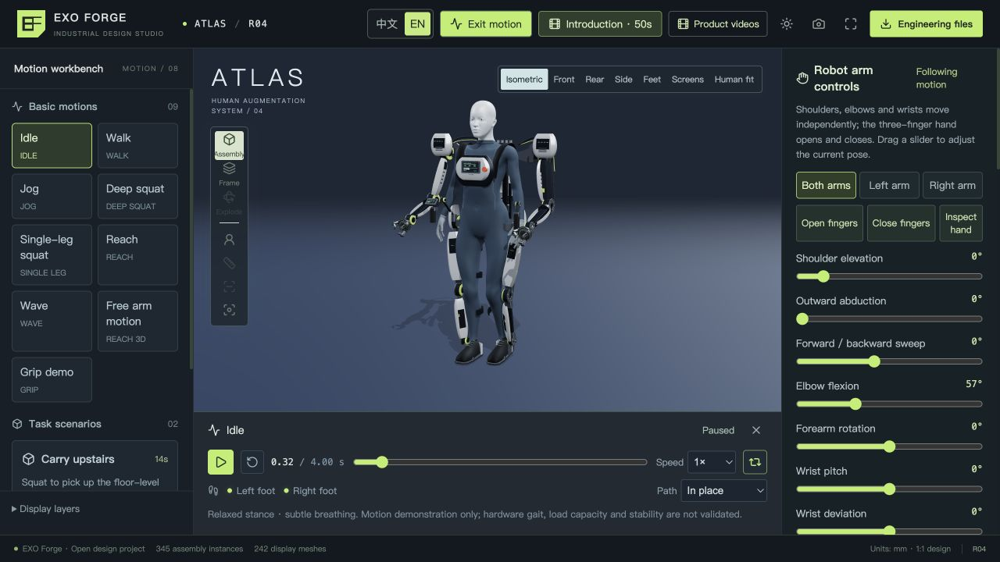

# EXO Forge Studio · ATLAS R04

[简体中文](README.zh-CN.md) · English

A browser-based design workbench for an exoskeleton concept that combines a human support structure, a proposed load path to the ground, and two articulated robot arms. Inspect the assembly, explore human motion, move three-finger hands, and play continuous task demonstrations.

User-directed and developed with **Astra**. This repository contains the interactive product, editable design sources, and the evidence needed to understand their current limits.



## Let Codex install and open it

Give this to a local Codex task:

> Install and start https://github.com/VIONWILLIAMS/EXO-Forge-Studio locally. Follow its AGENTS.md, prepare the runtime and assets, open the workbench, and verify model loading and motion playback.

[Agent instructions](AGENTS.md) · [Automatic installation, resource sources and troubleshooting](docs/INSTALL.md)

## Try it locally

The bootstrap installs Node.js and npm dependencies if needed. The runnable models, skeletons, reference data and videos are included; Git LFS, Blender, a backend and API keys are not required to view the app.

```sh
git clone --depth 1 https://github.com/VIONWILLIAMS/EXO-Forge-Studio.git
cd EXO-Forge-Studio
bash start.sh --lang en
```

On Windows, run `powershell -NoProfile -ExecutionPolicy Bypass -File .\start.ps1 --lang en` after cloning. Reuse the same command next time. The scripts install under the project directory and open the browser automatically. A fresh shallow clone downloads about **144 MB**, with about **342 MB** of uncompressed versioned files; reserve **2 GB** for the local runtime, dependencies and a build.

Default links: [the workbench](http://127.0.0.1:4177/?lang=en) or [the 50-second introduction](http://127.0.0.1:4177/?demo=intro&lang=en). These are local addresses: keep the server terminal running on your own computer. If 4177 is occupied, the bootstrap chooses the next free port and prints its real URL. `--port 4180` instead requires that exact port. See the [install guide](docs/INSTALL.md) for archive installation without Git.

Desktop browsers with WebGL2 are recommended. First model loading can take several seconds. The default Chinese/English toggle is in the header; your browser remembers the choice. A `lang=zh` or `lang=en` URL overrides it without discarding the other URL parameters.

## What you can explore

| Area | Included behavior |
| --- | --- |
| Assembly | R04 design with 112 part definitions and 345 instances; selection, visibility, inspection views, section/exploded static views and engineering downloads |
| Motion workbench | Idle, walking, jogging, deep squat, single-leg squat, reach, wave, free arm motion and grip demonstration |
| Continuous scenarios | A floor-level crate carried up stairs; basket-and-apple picking with a robot arm |
| Mechanical hands | Three articulated fingers, independent arm/wrist controls and grasp opening |
| Introduction | 50-second live sequence with chapters, captions, pause, seeking and automatic camera control |
| Bilingual UI | Assembly details, motion controls, scenario captions, reference plots, simulated displays and the legacy workbench |
| Media | Downloadable 50-second film and a full-interface product tour; original recordings show the Chinese UI |

Useful local links: [Walk](http://127.0.0.1:4177/?demo=walk&lang=en) · [Jog](http://127.0.0.1:4177/?demo=run&lang=en) · [Single-leg squat](http://127.0.0.1:4177/?demo=singleLeg&lang=en) · [Carry](http://127.0.0.1:4177/?demo=carry&lang=en) · [Picking](http://127.0.0.1:4177/?demo=harvest&lang=en) · [Legacy concept calculations](http://127.0.0.1:4177/?view=legacy&lang=en).

Switching language preserves the current motion, paused position, camera and manual control state. Video pixels are not translated by the live UI switch.

## Scope and evidence

**This is a digital concept and an engineering development input, not validated wearable hardware.** The project proposes routing loads to the ground; it does not demonstrate a measured load-bearing capability. It has no device connection. On-screen equipment values are simulated.

- Walking/running reference curves come from published healthy-participant datasets, with explicit project adaptations. They are not clinical reference limits or robot control parameters.
- Motion sequences and prop interactions are procedural choreography. Rendering and local contact checks do not establish whole-body collision safety, dynamics or stability.
- The included CAD reports document individual geometry and 20 selected interface checks. They do not approve manufacturing, procurement, a full assembly, fatigue or human wear/load testing.
- The three-finger display hand is newer than the static R04 CAD hand. Its full joints, actuation and production interfaces have not been backported to that CAD package.

See the [engineering handoff](cad/v04/README.zh-CN.md), [development notes](docs/DEVELOPMENT.md) and [release verification](docs/VERIFICATION.md). Keep historical reports distinct from tests you run today.

## Develop and verify

`bash start.sh --check` (Windows: append `--check` to the PowerShell command) installs, verifies resources, tests and builds. With Node/npm already on PATH, the original commands also work:

```sh
npm test
npm run build
npm run preview -- --host 127.0.0.1 --port 4177 --strictPort
```

The test suite includes translation coverage/state preservation, procedural motion, real GLB rig checks, scene trajectories and contracts for the bundled CAD reports. The report-contract checks read existing geometry reports; they do not rerun CAD geometry or hardware tests. CI runs the same install, test and build commands on Linux.

The build currently emits a large JavaScript chunk warning due to the 3D stack. Models are served separately. The app uses root-relative asset URLs, so deploy the built site at an origin root; repository subpath hosting needs a separate base-path adaptation. The public checkout produces a normal static site in `dist/`. An existing local `.openai/hosting.json` optionally enables the original Sites pipeline instead; no hosting credentials or developer-specific hosting configuration are included.

## Repository map

| Path | Purpose |
| --- | --- |
| `src/components/` | 3D scenes, assembly UI, motion controls, simulated displays and video library |
| `src/domain/`, `src/state/` | Procedural motion, rig/hand mapping, scenarios and playback state |
| `src/i18n/` | Chinese/English catalogs and locale persistence |
| `public/assets/v04/motion-m6/` | Current motion and three-finger static display models |
| `public/assets/v04/environment-m6/` | Crate, stairs, apple tree, basket and fruit |
| `public/assets/v04/video-m8/` | Finished MP4 recordings |
| `assets/source/` | Editable Blender sources, including earlier revisions |
| `cad/` | CAD generation scripts, design definitions and bundled STEP/STL/3MF outputs |
| `assets/vendor/`, `assets/reference/` | Third-party asset/data sources and licenses |
| `tests/`, `tools/` | Regression checks, authoring scripts and geometry audits |

Finished assets are versioned to make a normal clone runnable. Local recording frames, editor backups, caches, credentials and private hosting metadata are excluded. Only two small historical geometry reports are retained under `output/v04/` because the test suite references them.

## License and contributions

Project-authored files use the [MIT license](LICENSE), with third-party exceptions in [THIRD_PARTY_NOTICES.md](THIRD_PARTY_NOTICES.md). The MakeHuman base mesh is CC0; the gait datasets and derived curves are CC BY 4.0. Preserve their attribution when sharing related plots and recordings.

Contributions to motion quality, accessibility, translations, rendering performance and mechanical design documentation are welcome. Start with [CONTRIBUTING.md](CONTRIBUTING.md).
